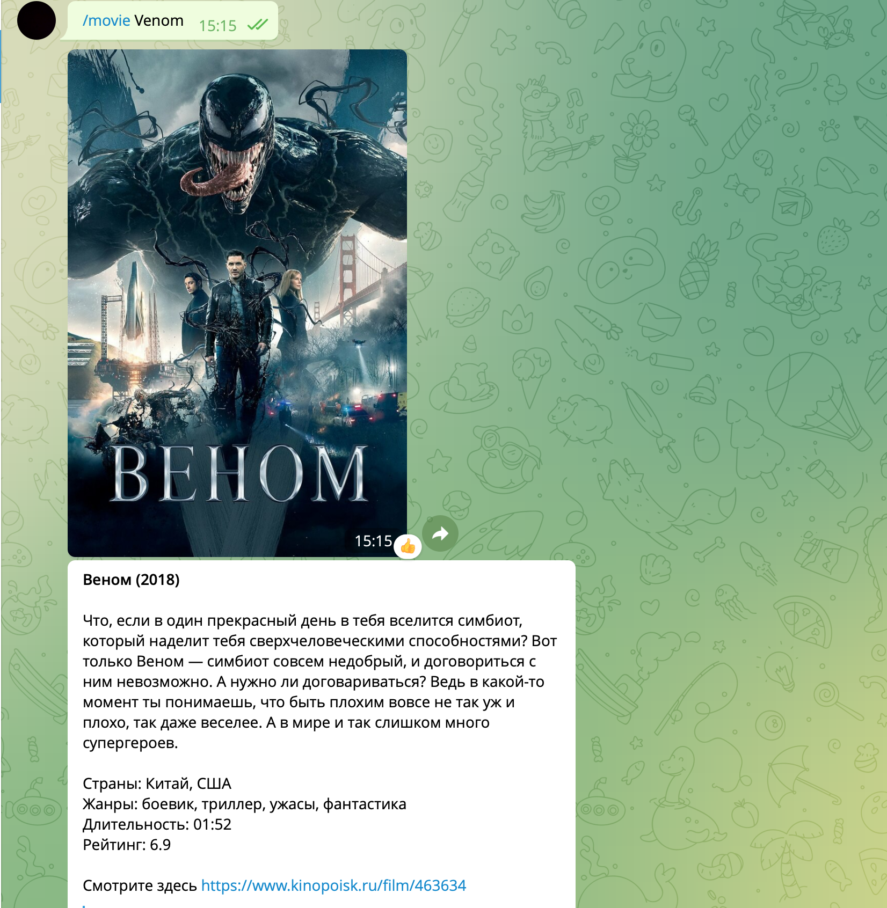

## Cinema Bot

Бот для подбора фильмов @CoolEveningMovieBot

### Команды

1) /start - просто приветствие.
2) /help - сводка об основных командах.
3) /history - история запросов, выводит запросы, для которых был найден фильм,
не больше 15 записей.
4) /stats - В порядке убывания выводит сколько раз был предложен каждый из фильмов, 
так же не больше 15 записей.
5) /movie фильм - ищет фильм по названию, выводит основную информацию о нём и постер.

### Устройство 

Для поиска фильма используется неофициальное апи кинопоиска, выводится первый предложенный фильм,
эмпирически проверено, что первый фильм выдачи самый релевантный. Есть абстрактный класс,
от которого наследуются классы для работы с определённым апи, помимо кинопоиска, реализован класс для работы 
с omdb, однако кинопоиск имеет всю необходимую информацию по фильмам, и содержит большинство российских фильмов, поэтому
я решил просто отказаться от использования 2 апи. Для хранения истории и статистики используется sqlite,
обращение реализовано через orm sqlalchemy, всего есть 3 класса - пользователь, фильм, предложенный одному из
пользователей и запрос пользователя. Обрабатывается множество ошибок, и некорректных запросов пользователя:
пустой ответ сервера, пустые запросы пользователя и т.д ...

### Деплой

Сервер поднят на яндекс облаке, работает бесперебойно.

